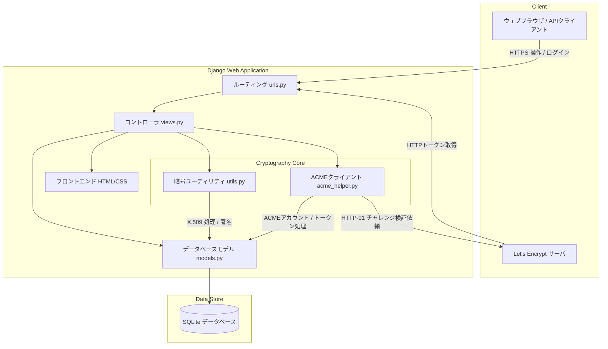

# AegisCert - システムアーキテクチャ設計書

本ドキュメントは、自動証明書発行サーバ「AegisCert」のシステムアーキテクチャおよび詳細設計を定義するものです。

---

## 1. システム概要
AegisCert は、個人利用、ホームラボ、および小規模オフィス向けに設計された、証明書の自動発行および一元管理を行うウェブアプリケーションです。
以下の2つの主要な証明書発行エンジンをサポートしています。
1.  **ローカル CA 方式 (プライベート認証局)**: システム内部に自己署名 Root CA を構築し、クライアント証明書やサーバー証明書を迅速に署名・発行します。
2.  **Let's Encrypt 方式 (公的認証局)**: ACME プロトコルを利用して、Let's Encrypt に対し証明書の発行要求を行い、公的に信頼された SSL/TLS 証明書を自動取得します。

---

## 2. システム構成・モジュール構造
システムは Django MVC アーキテクチャをベースとし、バックエンドの暗号制御エンジンと ACME クライアントエンジンを統合した構成になっています。



### ディレクトリ構造
*   `cert_project/`: プロジェクト全体の設定。
    *   [settings.py](file:///C:/Users/kobay/work/git/cert-mng/cert_project/settings.py) — 共通環境設定。タイムゾーン、言語、静的ファイルパス。
*   `certificates/`: アプリケーションメインモジュール。
    *   [models.py](file:///C:/Users/kobay/work/git/cert-mng/certificates/models.py) — 永続データの定義。
    *   [views.py](file:///C:/Users/kobay/work/git/cert-mng/certificates/views.py) — アプリ制御ロジック、ZIP生成処理。
    *   [urls.py](file:///C:/Users/kobay/work/git/cert-mng/certificates/urls.py) — チャレンジ受付エンドポイントを含むパス定義。
    *   [utils.py](file:///C:/Users/kobay/work/git/cert-mng/certificates/utils.py) — ローカルCAの鍵ペア生成、CSR署名、CRL作成ロジック。
    *   [acme_helper.py](file:///C:/Users/kobay/work/git/cert-mng/certificates/acme_helper.py) — Let's Encryptアカウント登録、ACME注文、検証同期処理。
    *   `templates/`: 画面UI。
    *   `static/`: UIスタイルシート・アセット。

---

## 3. 技術スタック
*   **フレームワーク**: Django 6.0.6 (Python)
*   **暗号技術ライブラリ**: Cryptography 49.0.0 (X.509 署名、RSA 2048-bit 暗号鍵処理)
*   **ACMEプロトコルクライアント**: acme 5.6.0 (Let's Encrypt 通信制御)
*   **データベース**: SQLite 3 (永続ストレージ)
*   **フロントエンド**: Vanilla HTML5, Vanilla CSS3 (グラスモフィズムダークテーマ設計), Vanilla JavaScript

---

## 4. データベース設計
データベースには、証明書発行および ACME 認証に必要な以下の4つのテーブルが定義されています。

### 4.1. [CertificateAuthority](file:///C:/Users/kobay/work/git/cert-mng/certificates/models.py#L6) (認証局設定情報)
システム内部で署名に利用されるルートCAキーペアと証明書を格納します。

| フィールド名 | 型 | 説明 |
| :--- | :--- | :--- |
| `id` | AutoField | 主キー |
| `name` | CharField(100) | CA の表示名 (デフォルト: Default CA) |
| `common_name` | CharField(255) | CA の共通名 (Subject CN) |
| `organization` | CharField(255) | 組織名 (O) |
| `country` | CharField(2) | 2文字の国名コード (C) |
| `private_key_pem` | TextField | PEM形式の CA 秘密鍵 (署名用) |
| `certificate_pem` | TextField | PEM形式の自己署名ルートCA証明書 |
| `created_at` | DateTimeField | 作成日時 |
| `valid_until` | DateTimeField | 有効期限 |
| `is_active` | BooleanField | 有効フラグ |

### 4.2. [IssuedCertificate](file:///C:/Users/kobay/work/git/cert-mng/certificates/models.py#L21) (発行済み証明書一覧)
発行した全ての証明書を追跡・管理するためのテーブルです。

| フィールド名 | 型 | 説明 |
| :--- | :--- | :--- |
| `id` | AutoField | 主キー |
| `common_name` | CharField(255) | 証明書の共通名 (ドメイン名やユーザー名など) |
| `organization` | CharField(255) | 組織名 (任意) |
| `country` | CharField(2) | 国コード (任意) |
| `issuer_type` | CharField(20) | 発行元区分 (`local`: ローカルCA, `letsencrypt`: Let's Encrypt) |
| `cert_type` | CharField(10) | 用途区分 (`server`: サーバー用, `client`: クライアント用) |
| `serial_number` | CharField(100) | X.509 シリアル番号 (一意) |
| `certificate_pem` | TextField | PEM形式のユーザー証明書 (フルチェーンを含む) |
| `private_key_pem` | TextField | PEM形式の秘密鍵 (サーバー生成時のみ格納、CSR署名時は空) |
| `csr_pem` | TextField | アップロードされた CSR ファイルの内容 (任意) |
| `issued_at` | DateTimeField | 発行日時 |
| `expires_at` | DateTimeField | 有効期限 |
| `is_revoked` | BooleanField | 失効フラグ |
| `revoked_at` | DateTimeField | 失効処理日時 (任意) |
| `user` | ForeignKey(User) | 所有している登録ユーザーのID |

### 4.3. [AcmeAccount](file:///C:/Users/kobay/work/git/cert-mng/certificates/models.py#L61) (ACMEアカウント情報)
Let's Encrypt との通信に利用する ACME アカウントキーおよび登録状況を保存します。

| フィールド名 | 型 | 説明 |
| :--- | :--- | :--- |
| `id` | AutoField | 主キー |
| `email` | EmailField | ACME 登録メールアドレス |
| `private_key_pem` | TextField | PEM形式のアカウント認証用秘密鍵 |
| `regr_json` | TextField | ACME サーバから取得した Registration オブジェクトの JSON 表現 |
| `is_staging` | BooleanField | Staging 環境か否かのフラグ |
| `created_at` | DateTimeField | アカウント作成日時 |

### 4.4. [AcmeChallenge](file:///C:/Users/kobay/work/git/cert-mng/certificates/models.py#L71) (ACME チャレンジ一時情報)
ドメイン検証用の一時的なトークンと応答データを格納します。

| フィールド名 | 型 | 説明 |
| :--- | :--- | :--- |
| `id` | AutoField | 主キー |
| `token` | CharField(255) | HTTP-01 チャレンジトークン (URLパスに利用、一意) |
| `validation` | TextField | チャレンジに対する応答キー（検証文字列） |
| `created_at` | DateTimeField | 作成日時 |

---

## 5. 証明書発行フロー詳細

### 5.1. ローカル CA 発行シーケンス
```
ユーザー ──(パラメータ入力)──> views.py
                                 │
                                 ├──> 1. DBから active_ca (秘密鍵・CA証明書) 取得
                                 │
                                 ├──> 2. 新規の非対称鍵ペア (RSA 2048-bit) 生成
                                 │
                                 ├──> 3. 各種拡張設定追加 (Basic Constraints, Key Usage, SANs)
                                 │
                                 ├──> 4. CA秘密鍵により X.509 署名を実行
                                 │
                                 ├──> 5. DBに格納 (IssuedCertificate)
                                 │
ユーザー <──(ZIP / CRTでDL)─────┘
```

### 5.2. Let's Encrypt (ACME) 発行シーケンス
```
ユーザー ──(ドメイン, メール)──> views.py ──> acme_helper.py
                                                    │
                                                    ├──> 1. AcmeAccount 照会/新規登録
                                                    │
                                                    ├──> 2. 新規証明書用の RSA 2048-bit 鍵と CSR 生成
                                                    │
                                                    ├──> 3. Let's Encrypt に対し注文 (Order) 送信
                                                    │
                                                    ├──> 4. 返却された HTTP-01 トークン・検証文字列を DB に保存
                                                    │
                                                    ├──> 5. Let's Encrypt に対し「準備完了」を回答 (answer_challenge)
                                                    │
                                                    ├──※ Let's Encrypt 検証サーバから HTTP-01 アクセスを受け付け
                                                    │    (/.well-known/acme-challenge/トークン -> 検証文字列を応答)
                                                    │
                                                    ├──> 6. サーバのバリデーション成功後、CSR finalize をリクエスト
                                                    │
                                                    ├──> 7. フルチェーン証明書をダウンロード
                                                    │
                                                    ├──> 8. チャレンジ情報をDBから削除し、証明書レコードを保存
                                                    │
ユーザー <──(ZIP / CRTでDL)─────┘
```

---

## 6. セキュリティ考慮事項
1.  **秘密鍵の暗号保護**:
    本システムでは簡易的なラボ利用を想定し、CA秘密鍵および証明書秘密鍵をPEMプレーンテキストでデータベースに格納しています。本番運用や商用環境で利用する場合は、Django 設定ファイルで定義した `SECRET_KEY` をシードとした AES 暗号化フィールドを導入するか、KMS (Key Management Service) または HSM (Hardware Security Module) への移行を行ってください。
2.  **ACME トークンエンドポイントの公開**:
    ACME検証を行うための `/.well-known/acme-challenge/` エンドポイントはログイン認証（Session/Cookie）をバイパスしてアクセス可能です。ただし、登録されていない任意のトークンに対しては確実に `404 Not Found` を返すことで、情報漏洩を防ぎます。
3.  **権限管理**:
    ログインした一般ユーザーは、自分が発行した証明書のみの照会およびダウンロードが可能です。`is_superuser` (管理者) のみ、全ユーザーが発行した証明書の一覧取得、失効処理、および Root CA の設定変更が許可されます。

---

## 7. 今後の拡張計画
*   **DNS-01 チャレンジのサポート**: DNS プロバイダ (Cloudflare, Route 53 等) の API を介した TXT レコードの自動書き換えに対応することで、HTTP ポートを開放できない閉域網でも Let's Encrypt 経由でワイルドカード証明書を発行できるようにする。
*   **自動更新エージェント**: バックグラウンドタスク (Django-Q, Celery等) または定期スケジュール cron を導入し、期限30日未満の Let's Encrypt 証明書の自動更新プロセスを構築する。
## 8. 最近の変更点

- **vHSM KMSバックエンド**  
  - `setup_ca.html` に「vHSM KMSバックエンドを使用する」チェックボックスを追加し、KMS 経由で秘密鍵を保存できるようにしました。  
  - `CertificateAuthority.kms_key_id` フィールドで KMS キー ID を保持し、KMS が有効な場合はローカル秘密鍵を使用しません。

- **URL 名前修正**  
  - 証明書失効エンドポイントの URL 名称を `revoke_cert_view` に統一しました。  
  - テンプレート `` が正しく逆引きでき、ダッシュボードの「失効」ボタンが機能します。

- **データベースマイグレーション**  
  - `certificates/0003_certificateauthority_kms_key_id_and_more.py` で `kms_key_id`、`encrypted_key_b64`、`kms_nonce_b64` カラムを追加しました。

- **セットアップスクリプト**  
  - `setup.bat` と `run.bat` がプロジェクトルートに配置され、仮想環境作成・依存インストール・KMS デーモン起動・サーバ起動を自動化します。
